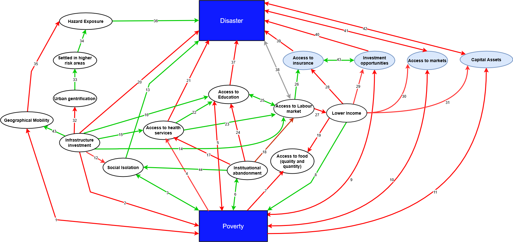
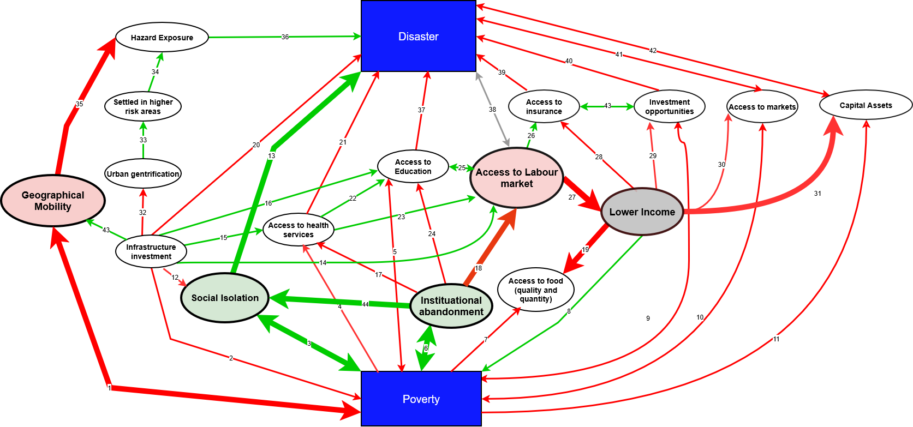

# The impact of disasters in social inequality: are vulnerable groups invisibilised?

# Introduction

The effect of disasters in societies, both contemporary and past ones, has been a pervasive subject of study for decades. It obviously makes sense that it is so, given the catastrophic effects of disasters in people's lives, both material and emotional and their potential damage to the stability of the society itself. One idea often studied is the impact of disasters on inequality levels in the societies that suffer them (Bui et al., 2014; Hallegatte et al., 2020; Izdebski et al., 2018) and whether they impact groups of different socioeconomic level differently (Hallegatte et al., 2020). One claim that has gained traction among some scholars is the idea that catastrophes (a category disasters fit in) actually reduce inequality in societies. For instance, Walter Scheidel -professor of ancient history at Standford university- even wrote a whole book[^1] about the idea that only events of massive violence and catastrophes have seriously and consistently decreased economic inequality throughout history. This idea should be approached with caution and a critical mind. Not only because it arguably contributes to an already existing romanticization of catastrophic events like wars and other conflicts, focusing on the alleged beneficial effects on inequality -risking downplaying the actual gravity of socioeconomic and cultural inequality as an issue in current societies... but because it also offers an incomplete and biased view on how these disasters disproportionally impact a society's most vulnerable groups. Therefore, this paper aims to challenge this idea, by showing how such analysis is incomplete and inadequate when it ignores how pre-existing challenges and inequality mechanisms already present make certain groups in society more vulnerable to disasters and their effects.

# Does Social inequality and group vulnerability mean the same to you and me?

Both _Social inequality_ and _Vulnerable groups_, as much as they are often used in formal communication -news outlets, political debates, NGO reports- and informal communication -activism speeches, social media, conversation between friends...- it can be challenging -if not impossible- to bring their abstract and intangible meaning down to the _real_ and actualised world.  
One obvious reason is that their very meaning is susceptible to the historical and sociocultural contexts the discussion about them takes place in, as well as who are the people o groups involved in the discussion. For instance, the question "Which are the vulnerable groups in our society" will almost certainly yield a different response in 12th century Europe than in modern day Nigeria.

Even within the same historical moment, different groups might answer the questions differently due to their own personal beliefs and/or biases. For instance, it wouldn't be unlikely that a group of 12th century peasants wouldn't see noble women as a vulnerable group, given how the quality of life of the latter was probably much higher than their own, ignoring how certain socio-cultural structures present impacted women irrespective of their social class.

# Poverty as a measure of Social Inequality and Vulnerability.

The idiosyncrasies mentioned above and the inherent difficulty of translating sociocultural relationships to quantifiable variables makes selecting a complete and informative measure to quantify Social Inequality and Vulnerability challenging. It is out of the scope of this paper to identify that measure, nor to give a detailed explanation of the mechanics and relationships involved in their calculation. Instead, this paper builds on top of existing research on disasters and their effects[^2] by Hallegatte et al., and disasters and their pressures throughout history[^3] by van Bavel et al.; and uses _Poverty_ as the main variable by what to measure Social inequality. Given that poor people are disproportionally affected by disasters (Hallegatte et al., 2020) this paper uses it to bridge disasters, social inequality and group vulnerability. It is essential, however, to briefly point out a critical aspect of how poverty is calculated or measured.

A conventional way to measure poverty is by association to asset possession. This is a reductionist approach that over-emphasises the importance of material economic assets while ignoring other factors of different nature. Such approach can -and often does- lead to the narrative that wealthier groups are more impacted by disasters -due to their higher asset loss- and to the preposterous claim that losses of poorer groups are lower than those of wealthier groups (Keerthiratne & Tol, 2017). This in itself wouldn't be alarming if such narratives didn’t influence policy making nor policy application in a way that aggravates social inequality after the events of a disaster -by assessing, for instance, that it is better to give funding to wealthier people, instead of helping people already living in poverty (Cookson et al., 2021)- as explained by Cookson et al. in their paper about quality of life and consumption levels[^4].  
To prevent this, this instead paper follows Hallegatte's approach on how a person's well-being is impacted by the effects of a disaster. Beside material and economic, factors like vulnerability to disasters, hazard exposure and socioeconomic resilience (a cluster of factors) are incorporated. This broader approach is cornerstone to this study, as it emphasises that poverty is not just an economic state related to material assets; poverty is a condition that imposes severe detrimental effects to a person's physic-mental, social, emotional and economical well being.  
This paper develops a conceptual framework that acts as foundation to later explain how, through existing structural mechanisms in society, already present when a disaster event takes place, its effects on vulnerable groups is magnified.

# Disasters and poverty: a conceptual framework

The conceptual framework illustrated in _Figure 1_ depicts the relationships (numbered, coloured arrows) between multiple factors (nodes) that influence individual wellbeing, the condition of _poverty_, and a person’s _vulnerability_ to disasters and their effects (_blue boxes_). Relationships are represented as _positive_ (green), _negative_ (red), or _context-dependent_ (grey), and can be either _unidirectional_ or _bidirectional_.

Although the structure can easily grow in complexity—making its representation in a two-dimensional space challenging—it provides a valuable advantage: it facilitates the identification of complex interconnections between factors. Two analytical levels of relationship can be distinguished based on their degree of connection: direct relationships, between adjacent nodes (e.g. relationship no. 31 between _Lower income_ and _Capital assets_), and indirect relationships, between non-adjacent nodes (e.g. the connection between _Access to education_ and _Capital assets_ through relationships 25, 27, and 31).

Beyond this classification by connection degree, a qualitative categorization can also be applied by grouping related factors. For instance, _Access to insurance_, _Investment opportunities_, _Access to markets_, and _Capital assets_ can be grouped under the category _Economic resilience_, a central concept in conventional unweighted monetary evaluation methods (Cookson et al., 2021). Conversely, the inclusion of factors such as _Geographical mobility_, _Settling in higher-risk areas_, _Urban gentrification_, _Infrastructure investment_, _Social isolation_, _Access to health services_, _Access to education_, _Institutional abandonment_, and _Access to the labour market_ introduces a socio-political dimension. This dimension allows for the analysis of _socio-economic resilience_, which is critical in understanding disaster impacts—particularly the capacity of poorer populations to respond to and recover from such events (Hallegatte et al., 2020).

Given the time and scope constraints of this research, explaining each relationship individually has been omitted. However, this could be expanded upon in future revisions—either as a dedicated annex or a separate paper.

There is one specific relationship that merits detailed discussion, as it exhibits a context-dependent qualitative dimension (positive or negative). Relationship number 38—between _Disaster_ and _Access to labour market_—illustrates how the direction of an effect can vary according to circumstances. The effects of a disaster on access to the labour market can be positive for survivors if the mortality it causes leads to a substantial reduction in the available workforce, thereby increasing the _market value_ of labour. The _Black Death_ of 1347–1352 is a well-documented example of this dynamic (van Bavel et al., n.d., ch. 6.3.1).  
Conversely, the effects can be negative when the destruction caused by a disaster prevents specific individuals or social groups from retaining or finding employment—such as low-income African Americans who lost their jobs after Hurricane Katrina (van Bavel et al., n.d., ch. 7.3.2).
  
#  
_Figure 1: Conceptual diagram of relationships between Poverty, Disasters and different Socio-Economic factors that shape that relationship. Positive relationships in green, that is relationships where the connecting factor has an positive effect on the connected factor - for instance, in relationship number 3, an increase of Social Isolation, leads to an increase on Poverty (aggravates poverty, and the other way around in this case)-; Negative relationships in red, that is relationships where the connecting factor has a negative effect on the connected factor -for instance, in relationship number 20, an increase of Infrastructure investment leads to a decrease in the vulnerability to and effects of Disasters (Reduces vulnerability and Mitigates its effects). It is easy to see how, with just a few factors, the complexity of the relationship between Disaster and poverty quickly grows, given the synergies between them._

# Has disaster analysis traditionally invisibilised vulnerable groups? The effects of the Black Death on women in England

Instead of going through the process of identifying or defining vulnerable groups, this research looked at what different modern day institutions define as vulnerable groups and which are the most commonly mentioned[^5]. This paper focuses on _Women_ as a vulnerable group, specifically in the context of the effects of the 14th Century Black Death on women's wages in England; and uses it as a case study to exemplify how women, as a vulnerable group of that time -and any time- saw the effects of the plague aggravated and the magnitude of the benefits reduced, due to the inequality mechanisms present in English society at the time... and how ignoring this would result in an incomplete and unfair analysis. Figure 2 below depicts an updated version of the conceptual diagram developed, accounting for women-specific vulnerability elements.

The Black Death plague reached England in June 1347, and its effects have been extensively researched (for instance, Robb et al., 2025[^6]). One of the repeated claims has been that it led to an increase of wages for workers due to the sudden scarcity of workforce (van Bavel et al., 2020, ch. 6.3; Humphries & Weisdorf, 2015, p. 419). However, contemporary research has also brought to attention that such statement obscures a more nuanced reality; women might not have actually benefitted nearly as much as men (van Bavel et al., 2020, ch. 6.3) and that their opportunity to benefit was conditioned by existing social and institutional mechanisms that impacted mainly women.

The regulatory changes introduced by the ruling class as a countermeasure to the sudden increase in the peasantry's power to negotiate better wages (Humphries & Weisdorf, 2015, p. 421) is a factor that, at surface level, might seem that it affected men and women equally (as the regulations applied to both of them). It is only by digging deeper into the existing societal mechanisms women as a group were exclusively subjected to that evidence against that assumption sprout. Research shows evidence of women being specifically punished for looking for jobs in other towns -decreasing factor _Geographical mobility-,_ rejecting contracts, they were forced to return to previous masters to finish a term, and were disproportionally punished for demanding better wages (Humphries & Weisdorf, 2015, p. 422).  
On top of the institutional oppression -in this study included as increasing factor _Institutional abandonment-_, women were subject to societal oppression coming from their con-citizens: unmarried women living on their own were the most mistrusted group and women travelling alone to other towns were seen as immoral or as competition for households with children (Humphries & Weisdorf, 2015, p. 423). This study accounts for them as increasing factor _Social isolation_.

Income is another parameter where the quantifiable effect of this societal oppression targeted at women -specially single ones- is manifest. There is a significant difference between how women on unskilled jobs benefitted from job scarcity depending on the temporality of their employment. Annual contracts did not see a significant change in income -a trend that continued for 200 years-, while casual daily employment wages saw a considerable boost for 50 years -although not as high as their male counterparts. (Humphries & Weisdorf, 2015, Fig. 3). In addition to that, there is evidence that women were more dissatisfied by the conditions and terms they got offered in their annual contracts, were less likely to renew, and more likely to leave early (Humphries & Weisdorf, 2015, p. 420). This difference is aligned with patterns that showed that married women had access to better-paid casual labour through their husbands, and that an independent living was harder to find for women (Humphries & Weisdorf, 2015, p. 420). This can be reasonably interpreted as a pressure to choose between economic security or independence; another example of a vulnerability aspect impacting women disproportionately.

#  
_Figure 2: Conceptual diagram of relationships between Poverty and Disasters and different Socio-Economic factors that shape that relationship, in the context of post Black Death England, accounting for women-specific vulnerabilities. Colored nodes indicate that being a woman translated into extra direct impact to that specific factor. Red indicates a reduction of the factor, green indicates an increase and gray indicates context dependency. Thicker arrows indicate that being a woman translated into that relationship being disproportionally impacted._

In the context of the Black Death in England, being a woman resulted in seeing their geographical mobility and access to the labour market reduced, being more socially isolated and suffer extra persecution by institutions. Women saw an increase in income when doing casual work -connected to a higher dependency to a husband figure- but an effective income reduction -when accounting for inflation- under annual contracts which lasted for more than 200 years.iscussion

The case study presented in this paper illustrates one of many possible examples supporting the central argument: the need to challenge disaster-analysis narratives that offer simplistic and superficial conclusions to such a complex subject. Although this limitation is not exclusive to disaster studies, we argue that topics directly concerning human wellbeing—such as social inequality—require particularly careful and nuanced scrutiny, given the historical use of research to reinforce social, economic, and political narratives that extend beyond purely scientific understanding. We believe it is the responsibility of researchers to approach their work with both critical awareness and humility, in order to minimise bias, preserve the integrity of scientific inquiry, and avoid contributing to the spread of misinformation—one of the most pressing challenges in contemporary society.

# Limitations

Given the complexity of the subject and the time and scope constraints for this research the conceptual framework created is considerably limited in depth and breadth. It is important to take this into account when extracting conclusions from this research and with the aims of engaging honest discussion. In addition, the use of other or additional variables as measure of Social inequality is encouraged as a potential continuation of this type of research.

# Use of generative AI

Generative AI -ChatGPT- has been used sparsely during the writing process of this paper to polish the writing style. The researchers would first write their own text and afterwards ask ChatGPT to assess the text clarity and apply some of the legibility changes suggested. In most cases those changes meant reducing the use of long sentences and/or replacing some words for more academic-style vocabulary.

# References

van Bavel, B., Curtis, D. R., Dijkman, J., Hannaford, M., de Keyzer, M., van Onacker, E., & Soens, T. (2020). _Disasters and History_.

Cookson, R., Skarda, I., Cotton‐Barratt, O., Adler, M., Asaria, M., & Ord, T. (2021). Quality adjusted life years based on health and consumption: A summary wellbeing measure for cross‐sectoral economic evaluation. _Health Economics_, _30_(1), 70–85. [https://doi.org/10.1002/hec.4177](https://doi.org/10.1002/hec.4177)

Hallegatte, S., Vogt-Schilb, A., Rozenberg, J., Bangalore, M., & Beaudet, C. (2020). From Poverty to Disaster and Back: A Review of the Literature. _Economics of Disasters and Climate Change_, _4_(1), 223–247. [https://doi.org/10.1007/s41885-020-00060-5](https://doi.org/10.1007/s41885-020-00060-5)

Humphries, J., & Weisdorf, J. (2015). The Wages of Women in England, 1260–1850. _The Journal of Economic History_, _75_(2), 405–447. [https://doi.org/10.1017/S0022050715000662](https://doi.org/10.1017/S0022050715000662)

Izdebski, A., Mordechai, L., & White, S. (2018). The Social Burden of Resilience: A Historical Perspective. _Human Ecology_, _46_(3), 291–303. [https://doi.org/10.1007/s10745-018-0002-2](https://doi.org/10.1007/s10745-018-0002-2)

Keerthiratne, S., & Tol, R. S. J. (2017). Impact of Natural Disasters on Financial Development. _Economics of Disasters and Climate Change_, _1_(1), 33–54. [https://doi.org/10.1007/s41885-017-0002-5](https://doi.org/10.1007/s41885-017-0002-5)

Robb, J., Dittmar, J. M., Inskip, S. A., Rose, A. K., Mitchell, P. D., O’Connell, T. C., Price, M., & Cessford, C. (2025). More continuity than change following the Black Death epidemic in medieval Cambridge. _Scientific Reports_, _15_(1), 33388. [https://doi.org/10.1038/s41598-025-18437-5](https://doi.org/10.1038/s41598-025-18437-5)  
  

[^1]: _The Great Leveler: Violence and the History of Inequality from the Stone Age to the Twenty-First Century_

[^2]: _From Poverty to Disaster and Back: a Review of the Literature_

[^3]: _Disasters and History: The Vulnerability and Resilience of Past Societies_

[^4]: _Quality adjusted life years based on health and consumption: A summary well being measure for cross‐sectorial economic evaluation_

[^5]: https://www.un.org/en/fight-racism/vulnerable-groups

[^6]: Just one of many examples. Other being: _Bailey, M. (2021)._ __After the Black Death: Economy, society and the law in fourteenth-century England___. Oxford University Press.; Jedwab, R., Johnson, N. D., & Koyama, M. (2022). The economic impact of the Black Death._ __Journal of Economic Literature, 60(1)___;_ __Poos, L. R. (1981). Plague mortality and demographic depression in later medieval England. Yale Journal of Biology and Medicine, 54(3)__
